<!-- Generated by scripts/gen-doc-graphs.ts - do not edit by hand.
     Run `pnpm run gen-doc-graphs` to regenerate. -->

# Cortex Base Composition

The cortex-base bundle patch shared by the web, headless, sdk, and acp profiles; their mode bundles and user layers patch over it, while sdk-minimal owns a separate standalone tree.

```mermaid
flowchart LR
  cfg["packages/bundle/base/cordis.patch.yml<br/>cordis.yml"]
  plugin_cortex_base_tool_plugin_manager["tool-plugin-manager<br/>@cortex/plugin-manager/tools"]
  cfg --> plugin_cortex_base_tool_plugin_manager
  plugin_cortex_base_plugin_manager["plugin-manager<br/>@cortex/plugin-manager"]
  cfg --> plugin_cortex_base_plugin_manager
  plugin_cortex_base_timer["timer<br/>@cortex/cordis-plugin-timer"]
  cfg --> plugin_cortex_base_timer
  plugin_cortex_base_hmr["hmr<br/>@cortex/hmr"]
  cfg --> plugin_cortex_base_hmr
  plugin_cortex_base_llm["llm<br/>@cortex/llm"]
  cfg --> plugin_cortex_base_llm
  plugin_cortex_base_deepseek_llm_api_extensions["deepseek-llm-api-extensions<br/>@cortex/deepseek-llm-api-extensions"]
  cfg --> plugin_cortex_base_deepseek_llm_api_extensions
  plugin_cortex_base_session["session<br/>@cortex/session"]
  cfg --> plugin_cortex_base_session
  plugin_cortex_base_session_log_deepseek["session-log-deepseek<br/>@cortex/session-log-deepseek"]
  cfg --> plugin_cortex_base_session_log_deepseek
  plugin_cortex_base_typert["typert<br/>@cortex/typert-registry"]
  cfg --> plugin_cortex_base_typert
  plugin_cortex_base_typert_loader["typert-loader<br/>@cortex/typert-loader"]
  cfg --> plugin_cortex_base_typert_loader
  plugin_cortex_base_typert_gateway["typert-gateway<br/>@cortex/api-gateway"]
  cfg --> plugin_cortex_base_typert_gateway
  plugin_cortex_base_session_title["session-title<br/>@cortex/session-title"]
  cfg --> plugin_cortex_base_session_title
  plugin_cortex_base_session_title_llm["session-title-llm<br/>@cortex/session-title-first-prompt-llm"]
  cfg --> plugin_cortex_base_session_title_llm
  plugin_cortex_base_user_questions["user-questions<br/>@cortex/user-questions"]
  cfg --> plugin_cortex_base_user_questions
  plugin_cortex_base_agent["agent<br/>@cortex/agent"]
  cfg --> plugin_cortex_base_agent
  plugin_cortex_base_plugin_package_inventory_deepseek["plugin-package-inventory-deepseek<br/>@cortex/plugin-package-inventory-deepseek"]
  cfg --> plugin_cortex_base_plugin_package_inventory_deepseek
  plugin_cortex_base_agent_default_model["agent-default-model<br/>@cortex/agent-default-model"]
  cfg --> plugin_cortex_base_agent_default_model
  plugin_cortex_base_jobs["jobs<br/>@cortex/jobs-local"]
  cfg --> plugin_cortex_base_jobs
  plugin_cortex_base_llm_retry["llm-retry<br/>@cortex/llm-retry"]
  cfg --> plugin_cortex_base_llm_retry
  plugin_cortex_base_config_editor["config-editor<br/>@cortex/config-editor"]
  cfg --> plugin_cortex_base_config_editor
  plugin_cortex_base_settings["settings<br/>@cortex/settings"]
  cfg --> plugin_cortex_base_settings
  plugin_cortex_base_authorization["authorization<br/>@cortex/authorization"]
  cfg --> plugin_cortex_base_authorization
  plugin_cortex_base_deepseek_account["deepseek-account<br/>@cortex/deepseek-account-platform"]
  cfg --> plugin_cortex_base_deepseek_account
  plugin_cortex_base_credentials["credentials<br/>@cortex/credentials-local"]
  cfg --> plugin_cortex_base_credentials
  plugin_cortex_base_llm_pi_ai["llm-pi-ai<br/>@cortex/llm-pi-ai"]
  cfg --> plugin_cortex_base_llm_pi_ai
  plugin_cortex_base_session_persistence_jsonl["session-persistence-jsonl<br/>@cortex/session-persistence-jsonl"]
  cfg --> plugin_cortex_base_session_persistence_jsonl
  plugin_cortex_base_attachment_local["attachment-local<br/>@cortex/attachment-local"]
  cfg --> plugin_cortex_base_attachment_local
  plugin_cortex_base_session_query_sqlite["session-query-sqlite<br/>@cortex/session-query-sqlite"]
  cfg --> plugin_cortex_base_session_query_sqlite
  plugin_cortex_base_session_projection["session-projection<br/>@cortex/session-projection"]
  cfg --> plugin_cortex_base_session_projection
  plugin_cortex_base_storage["storage<br/>@cortex/storage"]
  cfg --> plugin_cortex_base_storage
  plugin_cortex_base_storage_json["storage-json<br/>@cortex/storage-json"]
  cfg --> plugin_cortex_base_storage_json
  plugin_cortex_base_storage_domain["storage-domain<br/>@cortex/storage-domain"]
  cfg --> plugin_cortex_base_storage_domain
  plugin_cortex_base_session_projection_cache["session-projection-cache<br/>@cortex/session-projection-cache"]
  cfg --> plugin_cortex_base_session_projection_cache
  plugin_cortex_base_otel["otel<br/>@cortex/otel"]
  cfg --> plugin_cortex_base_otel
  plugin_cortex_base_session_telemetry_otel["session-telemetry-otel<br/>@cortex/session-telemetry-otel"]
  cfg --> plugin_cortex_base_session_telemetry_otel
  plugin_cortex_base_subprocess["subprocess<br/>@cortex/subprocess-local"]
  cfg --> plugin_cortex_base_subprocess
  plugin_cortex_base_sandbox["sandbox<br/>@cortex/sandbox-local"]
  cfg --> plugin_cortex_base_sandbox
  plugin_cortex_base_sandbox_policy["sandbox-policy<br/>@cortex/sandbox-policy"]
  cfg --> plugin_cortex_base_sandbox_policy
  plugin_cortex_base_bash_sandbox["bash-sandbox<br/>@cortex/bash-sandbox"]
  cfg --> plugin_cortex_base_bash_sandbox
  plugin_cortex_base_pwsh_sandbox["pwsh-sandbox<br/>@cortex/pwsh-sandbox"]
  cfg --> plugin_cortex_base_pwsh_sandbox
  plugin_cortex_base_approval["approval<br/>@cortex/user-approval"]
  cfg --> plugin_cortex_base_approval
  plugin_cortex_base_permission["permission<br/>@cortex/permission-presets"]
  cfg --> plugin_cortex_base_permission
  plugin_cortex_base_shell_env["shell-env<br/>@cortex/shell-env"]
  cfg --> plugin_cortex_base_shell_env
  plugin_cortex_base_tool_bash["tool-bash<br/>@cortex/tool-bash"]
  cfg --> plugin_cortex_base_tool_bash
  plugin_cortex_base_tool_pwsh["tool-pwsh<br/>@cortex/tool-pwsh"]
  cfg --> plugin_cortex_base_tool_pwsh
  plugin_cortex_base_tool_jobs["tool-jobs<br/>@cortex/tool-jobs"]
  cfg --> plugin_cortex_base_tool_jobs
  plugin_cortex_base_fs_observation_policy["fs-observation-policy<br/>@cortex/fs-observation-policy"]
  cfg --> plugin_cortex_base_fs_observation_policy
  plugin_cortex_base_tool_fs["tool-fs<br/>@cortex/tool-fs"]
  cfg --> plugin_cortex_base_tool_fs
  plugin_cortex_base_tool_fs_search["tool-fs-search<br/>@cortex/tool-fs-search"]
  cfg --> plugin_cortex_base_tool_fs_search
  plugin_cortex_base_agent_instructions["agent-instructions<br/>@cortex/agent-instructions"]
  cfg --> plugin_cortex_base_agent_instructions
  plugin_cortex_base_skill["skill<br/>@cortex/skill"]
  cfg --> plugin_cortex_base_skill
  plugin_cortex_base_skill_filesystem["skill-filesystem<br/>@cortex/skill-filesystem"]
  cfg --> plugin_cortex_base_skill_filesystem
  plugin_cortex_base_tool_skill["tool-skill<br/>@cortex/tool-skill"]
  cfg --> plugin_cortex_base_tool_skill
  plugin_cortex_base_commands["commands<br/>@cortex/commands"]
  cfg --> plugin_cortex_base_commands
  plugin_cortex_base_command_feedback["command-feedback<br/>@cortex/command-feedback"]
  cfg --> plugin_cortex_base_command_feedback
  plugin_cortex_base_goal["goal<br/>@cortex/goal"]
  cfg --> plugin_cortex_base_goal
  plugin_cortex_base_goal_round_driver["goal-round-driver<br/>@cortex/goal-round-driver"]
  cfg --> plugin_cortex_base_goal_round_driver
  plugin_cortex_base_command_goal["command-goal<br/>@cortex/command-goal"]
  cfg --> plugin_cortex_base_command_goal
  plugin_cortex_base_plan_mode["plan-mode<br/>@cortex/plan-mode"]
  cfg --> plugin_cortex_base_plan_mode
  plugin_cortex_base_token_meter["token-meter<br/>@cortex/token-meter"]
  cfg --> plugin_cortex_base_token_meter
  plugin_cortex_base_compaction_basic["compaction-basic<br/>@cortex/compaction-basic"]
  cfg --> plugin_cortex_base_compaction_basic
  plugin_cortex_base_command_compact["command-compact<br/>@cortex/command-compact"]
  cfg --> plugin_cortex_base_command_compact
  plugin_cortex_base_subagent["subagent<br/>@cortex/subagent"]
  cfg --> plugin_cortex_base_subagent
  plugin_cortex_base_subagent_spawn_in_process["subagent-spawn-in-process<br/>@cortex/subagent-spawn-in-process"]
  cfg --> plugin_cortex_base_subagent_spawn_in_process
  plugin_cortex_base_subagent_fork_in_process["subagent-fork-in-process<br/>@cortex/subagent-fork-in-process"]
  cfg --> plugin_cortex_base_subagent_fork_in_process
  plugin_cortex_base_subagent_codex["subagent-codex<br/>@cortex/subagent-codex"]
  cfg --> plugin_cortex_base_subagent_codex
  plugin_cortex_base_tool_subagent_control["tool-subagent-control<br/>@cortex/tool-subagent-control"]
  cfg --> plugin_cortex_base_tool_subagent_control
  plugin_cortex_base_tool_subagent_list_agents["tool-subagent-list-agents<br/>@cortex/tool-subagent-control/list-agents"]
  cfg --> plugin_cortex_base_tool_subagent_list_agents
  plugin_cortex_base_tool_subagent["tool-subagent<br/>@cortex/tool-subagent"]
  cfg --> plugin_cortex_base_tool_subagent
  plugin_cortex_base_tool_subagent_fork["tool-subagent-fork<br/>@cortex/tool-subagent"]
  cfg --> plugin_cortex_base_tool_subagent_fork
  plugin_cortex_base_ptc_runtime["ptc-runtime<br/>@cortex/ptc-runtime-node"]
  cfg --> plugin_cortex_base_ptc_runtime
  plugin_cortex_base_workflow_ptc["workflow-ptc<br/>@cortex/workflow-ptc"]
  cfg --> plugin_cortex_base_workflow_ptc
  plugin_cortex_base_tool_workflow["tool-workflow<br/>@cortex/tool-workflow"]
  cfg --> plugin_cortex_base_tool_workflow
  plugin_cortex_base_timeout_policy["timeout-policy<br/>@cortex/tool-call-timeout-policy"]
  cfg --> plugin_cortex_base_timeout_policy
  plugin_cortex_base_spill_local["spill-local<br/>@cortex/spill-local"]
  cfg --> plugin_cortex_base_spill_local
  plugin_cortex_base_spill_policy["spill-policy<br/>@cortex/spill-policy"]
  cfg --> plugin_cortex_base_spill_policy
  plugin_cortex_base_session_checkpoint_policy["session-checkpoint-policy<br/>@cortex/session-checkpoint-policy"]
  cfg --> plugin_cortex_base_session_checkpoint_policy
  plugin_cortex_base_tool_result_pruner["tool-result-pruner<br/>@cortex/compaction-tool-result-pruner"]
  cfg --> plugin_cortex_base_tool_result_pruner
  plugin_cortex_base_image_offload["image-offload<br/>@cortex/compaction-image-offload"]
  cfg --> plugin_cortex_base_image_offload
  plugin_cortex_base_tool_todo["tool-todo<br/>@cortex/tool-todo"]
  cfg --> plugin_cortex_base_tool_todo
  plugin_cortex_base_tool_goal["tool-goal<br/>@cortex/tool-goal"]
  cfg --> plugin_cortex_base_tool_goal
  plugin_cortex_base_tool_ralph["tool-ralph<br/>@cortex/tool-ralph"]
  cfg --> plugin_cortex_base_tool_ralph
  plugin_cortex_base_repeat_tool_reminder["repeat-tool-reminder<br/>@cortex/repeat-tool-reminder"]
  cfg --> plugin_cortex_base_repeat_tool_reminder
  plugin_cortex_base_web["web<br/>@cortex/web"]
  cfg --> plugin_cortex_base_web
  plugin_cortex_base_web_search_deepseek["web-search-deepseek<br/>@cortex/web-search-deepseek"]
  cfg --> plugin_cortex_base_web_search_deepseek
  plugin_cortex_base_web_fetch_http["web-fetch-http<br/>@cortex/web-fetch-http"]
  cfg --> plugin_cortex_base_web_fetch_http
  plugin_cortex_base_tool_web["tool-web<br/>@cortex/tool-web"]
  cfg --> plugin_cortex_base_tool_web
  plugin_cortex_base_mcp_resources["mcp-resources<br/>@cortex/mcp-resources"]
  cfg --> plugin_cortex_base_mcp_resources
  plugin_cortex_base_tools["tools<br/>@cortex/tools"]
  cfg --> plugin_cortex_base_tools
  plugin_cortex_base_system_prompt["system-prompt<br/>@cortex/system-prompt"]
  cfg --> plugin_cortex_base_system_prompt
  plugin_cortex_base_agent_loop["agent-loop<br/>@cortex/agent-loop"]
  cfg --> plugin_cortex_base_agent_loop
  plugin_cortex_base_fs_sandbox["fs-sandbox<br/>@cortex/fs-sandbox"]
  cfg --> plugin_cortex_base_fs_sandbox
  plugin_cortex_base_llm_deepseek["llm-deepseek<br/>@cortex/llm-deepseek-api-key"]
  cfg --> plugin_cortex_base_llm_deepseek
  plugin_cortex_base_llm_deepseek_account["llm-deepseek-account<br/>@cortex/llm-deepseek-account"]
  cfg --> plugin_cortex_base_llm_deepseek_account
```

| Plugin id | Package / module |
| --- | --- |
| `tool-plugin-manager` | `@cortex/plugin-manager/tools` |
| `plugin-manager` | `@cortex/plugin-manager` |
| `timer` | `@cortex/cordis-plugin-timer` |
| `hmr` | `@cortex/hmr` |
| `llm` | `@cortex/llm` |
| `deepseek-llm-api-extensions` | `@cortex/deepseek-llm-api-extensions` |
| `session` | `@cortex/session` |
| `session-log-deepseek` | `@cortex/session-log-deepseek` |
| `typert` | `@cortex/typert-registry` |
| `typert-loader` | `@cortex/typert-loader` |
| `typert-gateway` | `@cortex/api-gateway` |
| `session-title` | `@cortex/session-title` |
| `session-title-llm` | `@cortex/session-title-first-prompt-llm` |
| `user-questions` | `@cortex/user-questions` |
| `agent` | `@cortex/agent` |
| `plugin-package-inventory-deepseek` | `@cortex/plugin-package-inventory-deepseek` |
| `agent-default-model` | `@cortex/agent-default-model` |
| `jobs` | `@cortex/jobs-local` |
| `llm-retry` | `@cortex/llm-retry` |
| `config-editor` | `@cortex/config-editor` |
| `settings` | `@cortex/settings` |
| `authorization` | `@cortex/authorization` |
| `deepseek-account` | `@cortex/deepseek-account-platform` |
| `credentials` | `@cortex/credentials-local` |
| `llm-pi-ai` | `@cortex/llm-pi-ai` |
| `session-persistence-jsonl` | `@cortex/session-persistence-jsonl` |
| `attachment-local` | `@cortex/attachment-local` |
| `session-query-sqlite` | `@cortex/session-query-sqlite` |
| `session-projection` | `@cortex/session-projection` |
| `storage` | `@cortex/storage` |
| `storage-json` | `@cortex/storage-json` |
| `storage-domain` | `@cortex/storage-domain` |
| `session-projection-cache` | `@cortex/session-projection-cache` |
| `otel` | `@cortex/otel` |
| `session-telemetry-otel` | `@cortex/session-telemetry-otel` |
| `subprocess` | `@cortex/subprocess-local` |
| `sandbox` | `@cortex/sandbox-local` |
| `sandbox-policy` | `@cortex/sandbox-policy` |
| `bash-sandbox` | `@cortex/bash-sandbox` |
| `pwsh-sandbox` | `@cortex/pwsh-sandbox` |
| `approval` | `@cortex/user-approval` |
| `permission` | `@cortex/permission-presets` |
| `shell-env` | `@cortex/shell-env` |
| `tool-bash` | `@cortex/tool-bash` |
| `tool-pwsh` | `@cortex/tool-pwsh` |
| `tool-jobs` | `@cortex/tool-jobs` |
| `fs-observation-policy` | `@cortex/fs-observation-policy` |
| `tool-fs` | `@cortex/tool-fs` |
| `tool-fs-search` | `@cortex/tool-fs-search` |
| `agent-instructions` | `@cortex/agent-instructions` |
| `skill` | `@cortex/skill` |
| `skill-filesystem` | `@cortex/skill-filesystem` |
| `tool-skill` | `@cortex/tool-skill` |
| `commands` | `@cortex/commands` |
| `command-feedback` | `@cortex/command-feedback` |
| `goal` | `@cortex/goal` |
| `goal-round-driver` | `@cortex/goal-round-driver` |
| `command-goal` | `@cortex/command-goal` |
| `plan-mode` | `@cortex/plan-mode` |
| `token-meter` | `@cortex/token-meter` |
| `compaction-basic` | `@cortex/compaction-basic` |
| `command-compact` | `@cortex/command-compact` |
| `subagent` | `@cortex/subagent` |
| `subagent-spawn-in-process` | `@cortex/subagent-spawn-in-process` |
| `subagent-fork-in-process` | `@cortex/subagent-fork-in-process` |
| `subagent-codex` | `@cortex/subagent-codex` |
| `tool-subagent-control` | `@cortex/tool-subagent-control` |
| `tool-subagent-list-agents` | `@cortex/tool-subagent-control/list-agents` |
| `tool-subagent` | `@cortex/tool-subagent` |
| `tool-subagent-fork` | `@cortex/tool-subagent` |
| `ptc-runtime` | `@cortex/ptc-runtime-node` |
| `workflow-ptc` | `@cortex/workflow-ptc` |
| `tool-workflow` | `@cortex/tool-workflow` |
| `timeout-policy` | `@cortex/tool-call-timeout-policy` |
| `spill-local` | `@cortex/spill-local` |
| `spill-policy` | `@cortex/spill-policy` |
| `session-checkpoint-policy` | `@cortex/session-checkpoint-policy` |
| `tool-result-pruner` | `@cortex/compaction-tool-result-pruner` |
| `image-offload` | `@cortex/compaction-image-offload` |
| `tool-todo` | `@cortex/tool-todo` |
| `tool-goal` | `@cortex/tool-goal` |
| `tool-ralph` | `@cortex/tool-ralph` |
| `repeat-tool-reminder` | `@cortex/repeat-tool-reminder` |
| `web` | `@cortex/web` |
| `web-search-deepseek` | `@cortex/web-search-deepseek` |
| `web-fetch-http` | `@cortex/web-fetch-http` |
| `tool-web` | `@cortex/tool-web` |
| `mcp-resources` | `@cortex/mcp-resources` |
| `tools` | `@cortex/tools` |
| `system-prompt` | `@cortex/system-prompt` |
| `agent-loop` | `@cortex/agent-loop` |
| `fs-sandbox` | `@cortex/fs-sandbox` |
| `llm-deepseek` | `@cortex/llm-deepseek-api-key` |
| `llm-deepseek-account` | `@cortex/llm-deepseek-account` |

Source config: [`packages/bundle/base/cordis.patch.yml`](../../packages/bundle/base/cordis.patch.yml).

Maintenance mode: hybrid: the patch row list is parsed from its `cordis.yml`; app package expansion is curated from package source.
