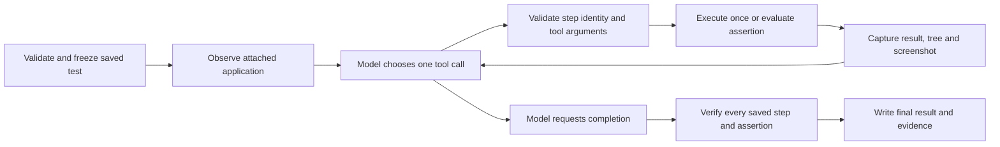

# Creating and running an AI test

The model decides; Testy executes the selected tool and checks the observed result. Creating a test and running a saved test are separate operations.

## Creation and refinement

1. The user describes the workflow and attaches a test application.
2. The authoring model receives the instructions, selected application's control snapshot, optional screenshot, and any existing test or run supplied for refinement.
3. If project tools are enabled, it can first list/read/search the selected repository and choose configured command IDs. It receives each real result and must satisfy configured prerequisites before submitting a structured proposal. Testy validates supported actions, selectors, values and timeouts before saving it as an editable test.
4. The user can inspect, reorder or revise the steps. A generated plan is not proof that the test works; execution supplies that evidence.

The demonstration route additionally supplies supported recorded actions and a separate explicit acceptance file. The proposed assertions must remain exactly equivalent; a changed assertion rejects the draft. Parameterized tests bind literal input/expected-value data before execution. See [authoring workflows](AUTHORING-WORKFLOWS.md).

## Preparation before launch

A [lifecycle profile](LIFECYCLE.md) begins without an attached application. The AI inspects the selected project, chooses the configured required build/reset commands, examines their actual results, and completes preparation. Testy then launches the configured executable and enters the saved-test loop below. The UI phase can inspect source but cannot repeat build commands. Preparation and UI acceptance have separate evidence; the whole lifecycle passes only when both phases pass and cleanup completes. An unavailable interactive desktop can prevent the worker stage even when command preparation succeeded.

## Saved-test execution

In local-tool mode, the model requests the next saved step by ID. It cannot change that step's action, value, timeout or acceptance. It can inspect again, select an explicitly authored guarded alternative when allowed, or stop. After a failed or uncertain mutation, it cannot retry through a different selector. Assertions may poll for their expected state; input operations are not automatically repeated.

Native computer-use mode receives model mouse/keyboard requests and validates their delivery against the saved workflow. Supported WPF operations and acceptance checks have separate canonical tools. Native mode requires a model/provider that supports the protocol, and its qualification is separate from local semantic automation.

The runner independently rejects incomplete, reordered, weakened or missing coverage. A model's statement that it succeeded never grants a pass. A failed run keeps the observed failure, screenshot, control state and diagnostic facts; model explanations are hypotheses unless the evidence establishes a cause.

## What the runtime can access

| Available context or action | Boundary |
|---|---|
| UI Automation and optional WPF probe | Selected attached process and its exposed controls |
| Images | Attached application screenshots, subject to provider image settings |
| Workflow/history | Supplied test, current run and tool results |
| Input | Supported validated actions through the selected driver |
| Worker launch | Host launches the specifically configured EXE; the model does not choose arbitrary commands |
| Local source files | Opt-in selected repository; bounded read/list/literal search with citations and redaction |
| Builds and command-line tests | Opt-in fixed host-configured command IDs; the model chooses when to call them |

Project access is disabled until explicitly configured. The runtime receives no general-purpose shell or automatic access to the computer's other projects. The configured programs themselves run with user privileges, so command configuration is a trust boundary. Failed, cancelled or timed-out commands block UI execution; successful commands require a fresh application observation before UI actions resume. Their results never count as UI acceptance. See [project configuration and limits](PROJECT-TOOLS.md), [computer-use contracts](COMPUTER-USE.md), and [workers](WORKERS.md).
